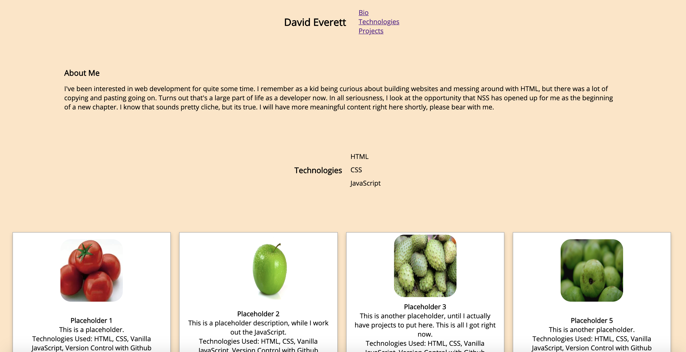

# personal-bio-site

## Description
This project is a work in progress.  This is a one page, personal website that is divided into three sections: About Me, Technologies, and Projects.  The current layout is achieved using flexboxes.  The About Me is a brief paragraph about who I am, and the Technologies section is a list of the front-end lanuages that I am learning: HTML, CSS, and JavaScript.  The Projects section features a flexbox of cards that contain detailed information about each project I have completed so far.  These are being displayed dynamically with JavaScript.
## Screenshots

## How To Run
1. Clone down this repository.
2. Make sure you have http-server installed via npm.  If not get it [HERE](https://www.npmjs.com/package/http-server)
3. On the command line, run `hs -p 8080`.
4. In your browser, to go `http://localhost:8080`.