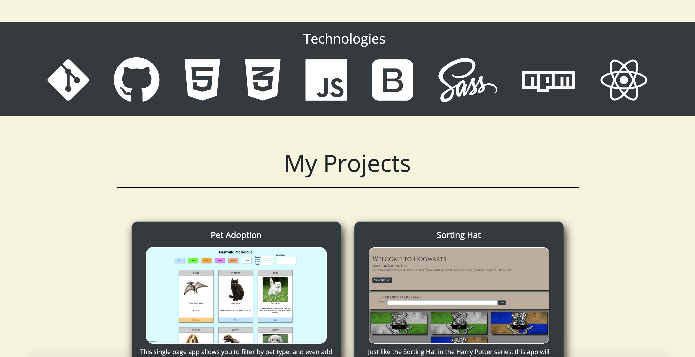

# David Everett's Personal Website

## Deployed Link
Check it out [HERE](https://david-everett.web.app/)

## Description
This project is a work in progress.  This is a one page, personal website that is divided into three sections: About Me, Technologies, and Projects.  The current layout is achieved using flexboxes.  The About Me is a brief paragraph about who I am, and the Technologies section is a list of the front-end lanuages that I am learning: HTML, CSS, and JavaScript.  The Projects section features a flexbox of cards that contain detailed information about each project I have completed so far.  These are being displayed dynamically with JavaScript.
## Screenshots

## How To Run
1. Clone down this repository.
1. `cd` into the new local repository after cloning is complete.
2. On your command line, run `npm install`.
3. After the installations are complete, on the command line, run `npm start`.